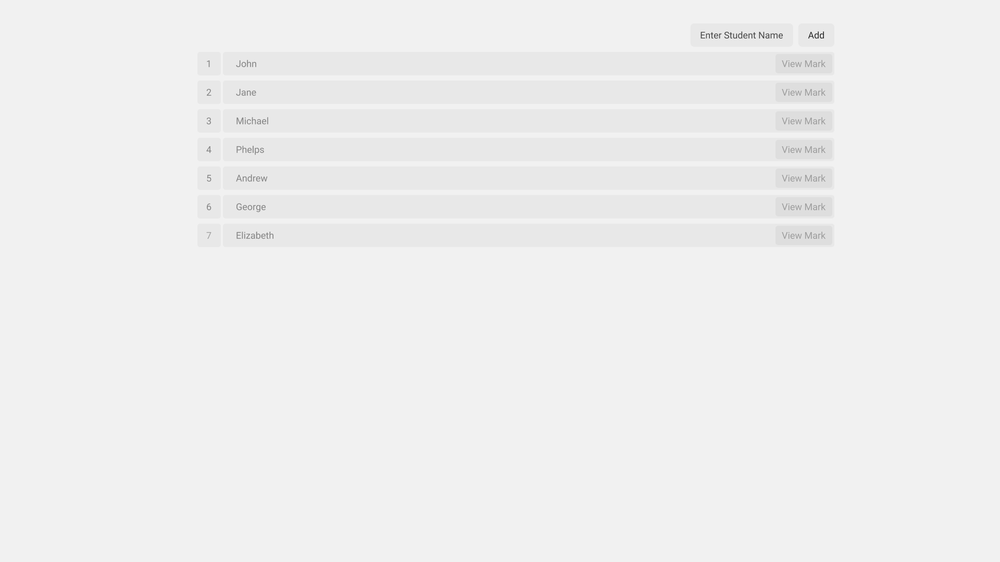

# **:star2: Task 7: Javascript Project**

## **:pushpin: Project**  
- Recreated the given website using HTML, CSS, Bootstrap and Javascript 

    
    

## **📂 Submission**
Submit the link to your hosted static website [Here](https://forms.gle/DdKFebZgZK5sgREFA). 
https://forms.gle/DdKFebZgZK5sgREFA

## **🌐 Resources**
- Bootsrap Modal https://getbootstrap.com/docs/4.0/components/modal/
- Read text input value https://www.geeksforgeeks.org/how-to-get-the-value-of-text-input-field-using-javascript/
